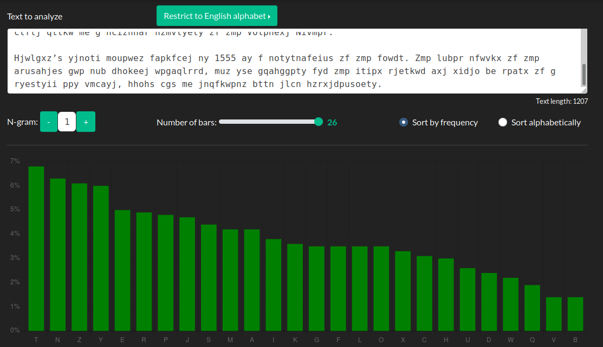
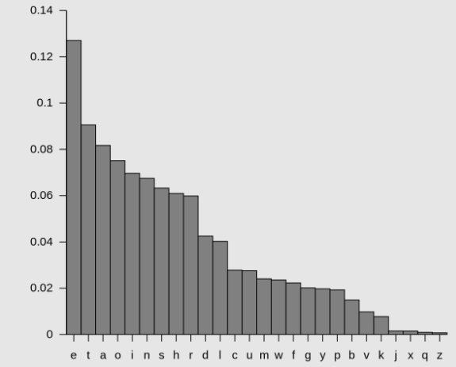
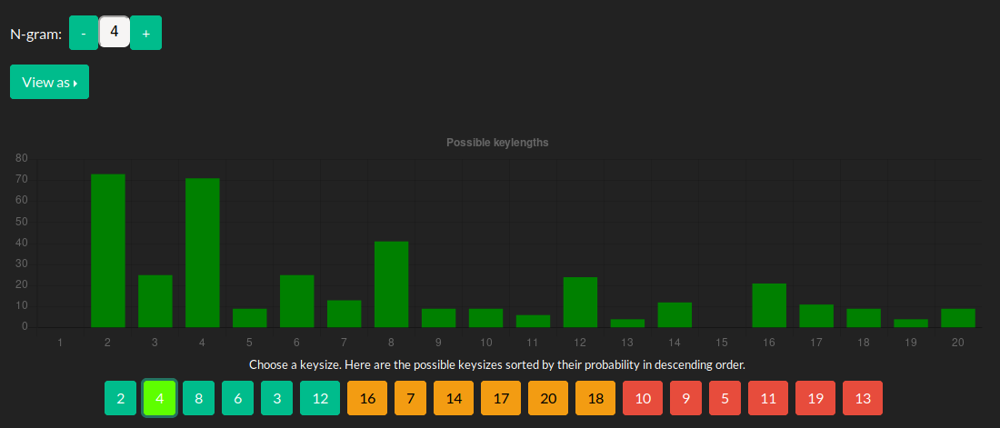
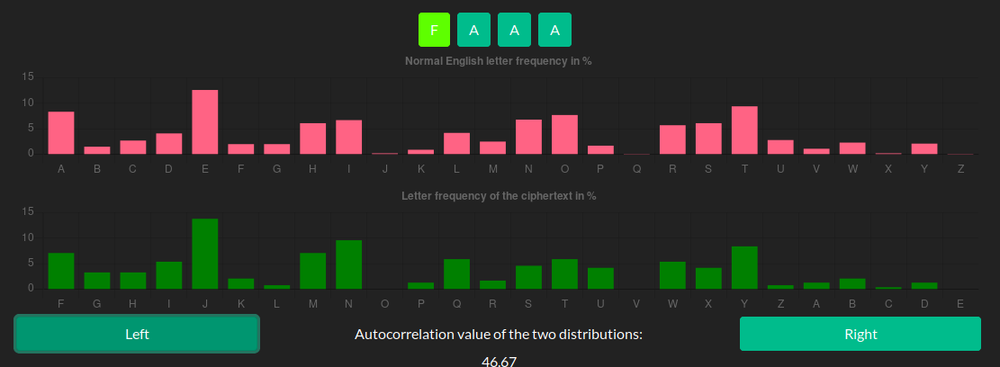
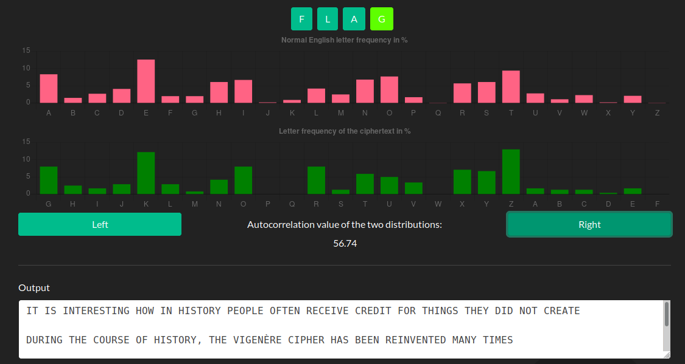

# picoCTF Oppg. 8 Crytpo

<!--TODO: Denne er kanskje lang og kronglete? Kan være en idé å finne en enklere måte å dekryptere Vigenère?-->

Her får vi en lang tekst som vi ser er kryptert. Ser vi kjapt gjennom ser vi de krøllede parentesene et sted: hgqqpohzCZK{m311a50_0x_a1rn3x3_h1ah3xf653pdkh}. Vi kan prøve å kjøre hele teksten gjennom en Ceasar Cipher decoder, men her finner vi faktisk ingenting. Her blir vi nødt til å bruke et dekrypteringshjelpemiddel. Jeg bruker her cryptool.org. Her kan vi først sende teksten gjennom en frekvensanalyse ("Frequency Analysis" under "Cryptoanalysis"). Vi ser her at frekvensen av de forskjellige bokstavene er mye mer "glattet" ut enn det som er vanlig i det engelske språket. 

Vi kan altså anta at vi bruker en form for kryptering som glatter ut frekvensene av de forskjellige bokstavene. Da er Vigenère naturlig å bruke. Vi åpner "Vigenère Analysis" under "Cryptoanalysis" og kopierer inn chifferteksten. (Enkleste er å bare søke når du er på den grønne versjonen av cryptool.) 
Vi får ikke noe hjelp av oppgaven og må selv gjette hvor lang nøkkelen er. I Cryptool, kan vi se på forskjellige N-gram. Dermed vil Cryptool hjelpe med å gjette hvor lang nøkkelen er etter å se på statistikk over det engelske alfabetet. På 1-, 2-, og 3-gram sier den at det er høyest sannsynlighet for at nøkkelen er 2 karakterer lang, men med 4 på andreplass. På 4- og 5-gram forteller den at 4 er mest sannsynlig med 2 på andreplass. Ettersom det den vanligste ordlengden, i gjennomsnitt, i det engelske språket er 4,7 bokstaver, stiller 4- og 5-gram sterkere enn 1-, 2- og 3-gram. Derfor stoler vi på at nøkkelen er 4 karakterer lang. 

Vi trykker da på tallet 4 litt under. Her ser får vi først opp 4 A'er, så to sett med søyler. De fire A'ene er det vi inn så lenge antar er nøkkelen. Vi markerer den første helt til venstre. Deretter er jobben  å trykke "Right"/"Left" slik at søylene matcher mest mulig overens. Både i høyde på søylene, men og hvor de "klumper seg rundt hverandre". Vi kan og se på tallet mellom "Right"- og "Left"-knappene og få det slik at Autcorrelation-tallet blir så lavt som mulig. Hvis vi da trykker oss fram til at den første karakteren i nøkkelen vår, altså bokstaven lengst til venstre, blir til en F, ser det rimelig riktig ut i forhold til søylene. 

Vi kan da bevege oss over til den neste karakteren. Fortsetter vi på samme måte her, ser vi at det blir en L. Vi fortsetter på samme måte, og får A og G på de neste. Vi har da antatt at nøkkelen er "FLAG". Dersom vi ser outputtet under, ser vi at vi plutselig kan lese det som står der. Les gjerne det for å få litt bakgrunnshistorie til Vigenère Cipher. 

Flagget finner vi i den dekrypterte teksten: PICOCTF{B311A50_0R_V1GN3R3_C1PH3RA653EDEC}. 