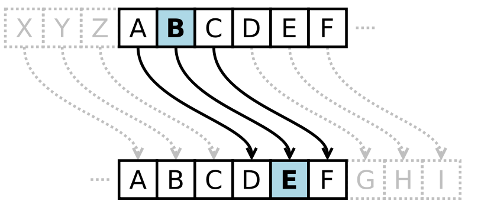

# Substitusjon 

Nødvendige forkunskaper: "Intro"

Substitusjon betyr å bytte ut. Det betyr at vi bytter ut en bokstav med en annen. Hvordan vi velger å bytte ut bokstaven, avhenger av hva slags kryptering vi ønsker å bruke. I _Ceasar Cipher_, ser vi på alfabetet vårt og velger hvor mange plasser bort vi ønsker å hoppe. Da blir nøkkelen antall plasser. Det finnes mange måter å velge hvordan man bytter ut bokstaver på, og det er det substitusjonskryptering handler om. Når vi "plusser" sammen bokstaver og forflytter oss i alfabetet, kaller vi dette et _shifted alphabet (skiftet alfabet)_. 

Når vi snakker om et _Simple substitution cipher_, mener vi at det kun bruker ett alfabet kombinert med én nøkkel. 

## Ceasar Cipher
Den simpleste formen for kryptering innenfor substitusjon kalles _Ceasar Cipher_. 
Dersom vi bruker oversettelsen at A=1, B=2 osv, så plusser vi på et gitt tall (nøkkelen) og får en kryptert melding ut. Dersom vi f.eks. har bokstaven A(=1) og plusser på 5, får vi tallet 6. Dette blir da representert som F. For å dekryptere vil vi da kun trekke fra tallet 5. Det som er viktig å huske på, er at dersom vi plusser på et tall og havner over 26, begynner vi på nytt i alfabetet. (Se "Modulær aritmetikk" under "Tall og Alfabet")

eks: 
Melding, M = "HEISANN" = 8 5 9 19 1 14 14
Nøkkel, K = 8
Krypteringsfunksjon, E = Ceasar Cipher

Kryptert tekst:
 C = E(K, M) = Ceasar Cipher(8, "HEISANN") = 8+8 5+8 9+8 19+8 1+8 14+8 14+8 = 16 13 17 27 9 22 22 = "PMQAIVV". 

Dekryptert tekst:
M = D(K, C) = Ceaser Cipher-1(8, "PMQAIVV") = 16-8 13-8 17-8 1-8 9-8 22-8 22-8 = 8 5 9 (-7) 1 14 14 = "HEISANN"

Kommentar: Legg merke til at vi  får tallet 27 (S=19 så plusser vi på 8) når vi krypterer. På samme måte, får vi -7 når vi dekrypterer. -7 tilsvarer da 19 som er bokstaven "S". I vårt tilfelle er Z=26, så 27 blir da A=1. Vi har altså, så vidt, gått en runde rundt klokka og havner på A igjen, som er 1. Hvis vi skulle ha brukt modulær beregning direkte, ville A vært 0, og Z vært 25. Derfor er det viktig å ha tunga rett i munn og være sikker på hvordan du har tallfestet bokstavene. Ved en runde rundt klokka, er dette ikke noe problem, fordi da kan vi egentlig bruke vanlig modulær aritmetikk og trekke fra 1 og få riktig svar. Men dersom vi f.eks. går 17 ganger rundt klokka, må vi eventuelt trekke fra 17 og da begynner det å bli litt kronglete. Derfor er det enklest å ha det på måten A=1 hvis vi jobber med små tall, men heller bruke A=0 hvis vi jobber med store tall.

Hvis vi bruker A=0, B=1, ... Z=25, får vi følgene: 
C = E(K,M) = M + K mod26 der M er hver enkelt bokstav og K er nøkkelen, i dette tilfellet. 
M = D(K,M) = M - K mod26