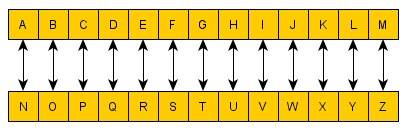

# ROT13

Nødvendig forkunskap: "Substitusjon og Ceasar Cipher", "Intro"

En svært vanlig form for _Ceasar Cipher_, er _ROT13_. Dette er helt vanlig _Ceasar Cipher_, men nøkkelen er 13. _ROT13_ står egentlig for "rotate by 13 places", som er _Ceasar Cipher_ med K=13. Det betyr at _ROT13_ flytter hver bokstav 13 plasser i alfabetet. _ROT13_ er spesielt mye brukt fordi den splitter det engelske alfabetet i to. Det medfører  at funksjonen for å kryptere er helt lik funksjonen for å dekryptere. Dermed er det en svært enkel form for kryptering. 



I terminalen på Unix, altså i _bash_, har Ceasar Cipher og ROT13 kan vi bruke _tr_-kommandoen for enkle substitusjoner (trenger ikke å laste ned noe):

```bash
 mathias@kali:~$ tr A-Za-z N-ZA-Mn-za-m
 ``` 
Det som skjer her, er at vi bruker kommandoen _tr_, "translate". Delen _A-Za-z_ er det vi kaller _set1_ her definerer vi hvlke bokstaver som skal byttes ut med noe annet. Siden vi både har _A-Z_ og _a-z_, betyr det at alle de store bokstavene og alle de små bokstavene skal byttes ut. Den andre delen, _N-ZA-Mn-za-m_, er det vi kaller _set2_. Her forteller vi hva som skal skje med _set1_. Hvis vi kun ser på de store bokstavene først, blir det enklere. Vi ser at A-Z er _set1_. _N-ZA-M_ er _set2_. _set2_ sier egentlig at alfabetet er splittet på midten og de to delene av alfabetet har byttet plass, hvilket faktisk er det samme som _ROT13_.

I praksis kan kommandoen fungere slik: 
```bash
 mathias@kali:~$ echo "Her er tekst jeg vil kryptere" | tr A-Za-z N-ZA-Mn-za-m
 Ure re grxfg wrt ivy xelcgrer
 ``` 
Outputtet, "Ure re grxfg wrt ivy xelcgrer" er da kryptert med _ROT13_.

Et triks for å slippe å huske denne kommandoen hele tiden er å bruke kommandoen _alias_. Det denne kommandoen gjør, er å endre en lang kommando til det du har lyst til:

```bash
 mathias@kali:~$ alias rot13="tr A-Za-z N-ZA-Mn-za-m"
 ``` 

 Vi kan da skrive: 
```bash
 mathias@kali:~$ echo "Ure re grxfg wrt ivy xelcgrer" | rot13
 Her er tekst jeg vil kryptere
 ``` 
 for å dekryptere. Legg også merke til hvordan vi bruker den samme funksjonen til å kryptere som å dekryptere. Vi kan altså se hvordan _ROT13_ er sin egen invers. 

 _ROT13_ og _Ceasar Cipher_ her veldig greie å fortså og det er rimelig rett fram å kryptere. Problemet er at siden krypteringen baserer seg på hvor mange ganger vi flytter oss i alfabetet, er det ikke alt for mange mulige nøkler. Det er bare 25 forskjellige måter å ha det på. Det er veldig enkelt for et dataprogram eller til og med et menneske å se hva nøkkelen er. Man kan da lete etter typiske 3-gram (ord satt sammen av 3 bokstaver), som f.eks.. "The" og anta hva nøkkelen er. 