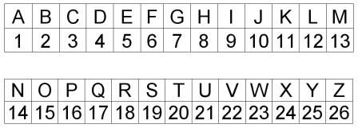
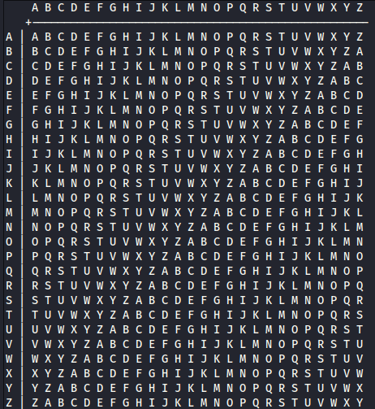

# Vanlig måte å representere bokstaver
I kryptografi, og spesielt i CTF, er det noen ganger vanlig å representere bokstaver via tall på en enklere måte. Vi kan kalle A for 0 eller 1, B for 2, C for 3 osv. Dette skaper en rimelig og intiuitiv representasjon på bokstaver. I de fleste former for kryptografi, er dette den absolutt vanligste måten å representere bokstaver på. Grunnen til det, er at vi kan kryptere, ved å f.eks. plusse tall sammen, slik at man får et nytt tall. (Se Ceasar Cipher).

 

 Generelt når vi skal plusse sammen bokstaver, kan det være gunstig å bruke en lik tabell:

Her kan vi tenke at hvor bokstav på toppen, er klarteksten og for hver bokstav nedover, på venstre siden har vi plusset på et tall. F.eks. dersom vi har "C" som klartekst og skal plusse på 2, går vi ned til "C" ("A"=0) på venstresiden og ser hva vi får i midten, altså "E".

## ASCII
http://cactus.io/tutorials/web/what-is-an-ascii-code
ASCII (American Standard Code for Information Interchange) er et standardisert alfabet som forteller hvordan vi går over fra tall til bokstaver og tegn. Som nevnt, jobber datamaskiner kun med binære tall, men for at vi skal kunne tolke hva som står, er vi nødt til å ha en standard for å forstå hvilke binære tall som kan bli til hva slags bokstaver, desimale tall og andre tegn. 

Det originale ASCII-alfabetet ble laget på 8 bits, men kun 7 ble brukt i alfabetet. Den åttende bitten ble brukt til _error korrigering_, noe vi ikke skal gå inn på her. Det betyr at det kun er 128 mulige tegn man kan lage med det originale ASCII-alfabetet. Det inkluderte altså ikke mange forskjellige tegn, blant annet “æ”, “ø” og “å”.
Senere har det kommet “extended ASCII”, der alle 8 bitsene brukes, som inkluderer mange flere tegn (256 kombinasjoner). 

Det dette betyr, er at når man trykker en knapp på tastaturet, får datamaskinen en kommando, representert med bits, så vi den oversette til ASCII og forstå hva som skal skje. Trykker man f.eks. _backspace_-knappen, tolker datamaskinen dette som tallet 8 i desimal, 0b00001000 eller 0x08. “CTF” blir til 0x43 54 46 (i hex, se “0x”). Slik oversettes altså 1 og 0 i datamaskinen til bokstaver og tegn som vi kan lese. 
