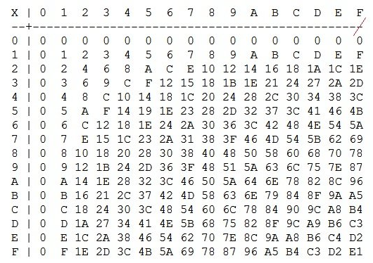

# Heksadesimale tall
Et annet vanlig tellesystem som brukes i datamaskiner er det heksadesimale systemet (16-tallssystemet, kan og bare kalle det “hex”). Dette brukes gjerne fordi det passer veldig bra sammen med det binære systemet, og gjør det enklere å representere store tall. Det er enkelt å gå fra hex til bin (binær) og motsatt, fordi et hex-tall utgjør ½ byte, altså 4 bits. 
For å telle på hex, teller man som vanlig, fra 0-9. Men når man når 10, bruker man bokstaven A. 11 blir B osv. Mer at vi stopper på 15, som er F i hex. 

For å gjøre om fra hex til bin og motsatt, kan man enkelt se på ett og ett siffer på hex-tallet, eller 4 og 4 bits på det binære. Så kan man legge sammen og det er det. 
Har vi f.eks. tallet 1F45 (8005 på desimal), ser vi først på 1. I binært er det 0001 (med fire sifre). F, 15 på desimal, blir 1111, 4 er 0100 og 5 er 0101. Dermed blir 1F45 i binært lik 0001 1111 0100 0101. 

 

På samme måte som vi representerer binært med 0b foran, er det vanlig å representere hex med 0x foran. Vi kan da skrive f.eks. 0x1f45 = 0b0001111101000101. 

I CTF er det en stor fordel å ha disse kunnskapene. Men det er ikke nødvendigvis at man gidder å sette seg ned og skrive hva som er hva. Derfor er det vanlig, og helt lov, å bruke kalkulatorer på internett hvis man får sånne oppgaver som det her. 

Merk at man kan, i teorien, bruke hva slags tellesystem man ønsker. Bin, desimal og hex er de mest vanlige, men det er fint mulig å treffe for octa (8-tallssystemet) og mange andre varianter. 