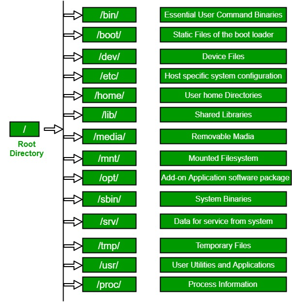
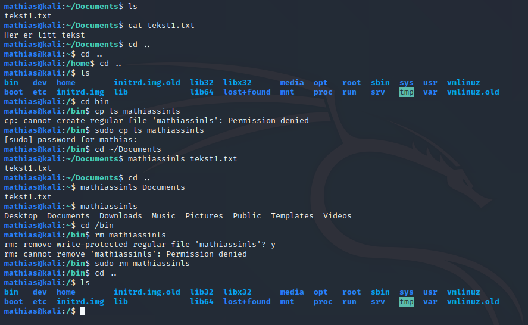
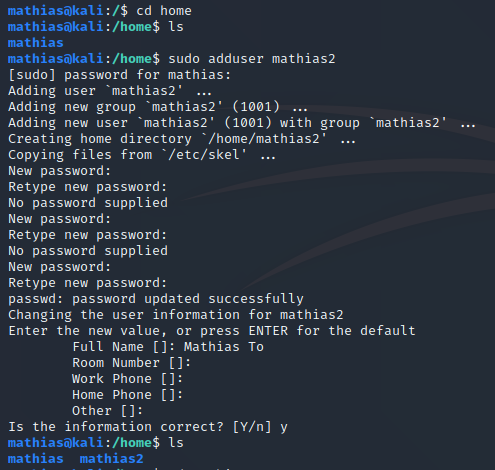

# Linux fil-hierarki

(Her kan det være lurt å ha lest deler at "Terminalkommandoer").

 Linux er basert på et _filsystem_. Det betyr at alt er på en eller annen måte en fil. Hvis du skal endre på brukere på PC'en, finner du det i en fil. Nettverkskonfigurasjoner: i en fil. Bilder du har lastet ned er filer. Til og med kommandoene vi bruker er filer. Derfor er det greit å vite hvordan filsystemet ser ut. 

 

Fra "Terminalkommandoer" har vi for det meste operert i /home/-mappa. Bildet over gir en oversikt over diverse filer og hva de inneholder. Vi skal nå se litt på noen av disse.

## bin
_bin_ står for "binaries". Det er filer som ikke er leselig for mennesker, men for datamaskinen. Ved å ha slike filer, kan datamaskinen f.eks. utføre kommandoer. Så det _bin_ inneholder er de mest essensielle kommandoene vi bruker, som f.eks. _ls_. Det betyr at når vi bruker _ls_-kommandoen, henter vi egentlig bin-filen til _ls_. Med de kommandoene vi har lært fra "Terminalkommandoer", kan vi altså gjøre noe kult:

Det jeg har gjort her er å gå inn i _bin_, kopiert _ls_-filen og kalt den _mathiassinls_. Ved å gjøre det kan jeg faktisk bruke den nye kommandoen _mathiassinls_ til å liste innhold i mapper. Merk at dette ikke egentlig er så lurt å gjøre. Ting som er i _bin_ kan være greit å la være.
Merk at vi her trenger _sudo_. 

## sbin
_sbin_ er for det meste det samme som _bin_, nemlig binary-filer. Forskjellen er at _sbin_ inneholder filer som kun administratorer skal ha tilgang til. Det kan være f.eks. å legge til brukere, ved kommandoen _adduser_.

## usr
Denne mappen inneholder kommandoer som brukerene kan kjøre. Det som er rart, er at i /usr, finner vi og _bin_ og _sbin_. /usr/bin og /usr/sbin inneholder nesten akkurat det samme. Grunnen til at vi har disse mappene er to forskjellige steder er hovedsakelig av historiske årsaker som vi ikke trenger å gå inn på. En mappe som er viktig, er /usr/local. Denne brukes til å lagre binary-filer som du selv kan lage. 

## boot, var, tmp og lib
Boot: filer maskinen trenger for å boote opp (starte opp).
Var: log-filer. Dersom man f.eks. prøver å bruke _sudo_-kommandoen uten å være sudo-bruker, kommer det informasjon om at det blir rapportert. Det er ikke farlig men blir lagret her.
tmp: filer som blir slettet, ved f.eks. en reboot.
lib: viktige filer som andre kommandoer og prosesser trenger for å fungere som de skal.

## home
Dette er hjem-mappa til alle brukere. Vi har sett hvordan tilde-tegnet (~), representerer hjem mappa til en bruker. Som nevnt, er det det samme som /home/mathias, siden jeg har vært logget inn på mathias. Ved å legge til brukere, finner vi de andre brukerne sitt "hjem" under denne mappa. 

Når man legger til en bruker, ser vi altså at brukeren får en _group_ (1001 i dette tilfellet). Dette kommer vi tilbake til senere. Samtidig står det 1001 i parentes bak navnet på den nye brukeren, ("mathias2" (1001)). Det er brukerID'en til den nye brukeren. Vi ser og hvordan det blir opprettet et _home_-directory for den nye brukeren. Man trenger ikke fylle inn informasjonen om rom-nummer osv, bare trykk enter og hopp over det. 

Selv om vi ikke ser det på bildet av hierarkiet, er det og en mappe der som heter _root_. Dette er hjem-mappa til _root_-profilen. _root_-profilen ønsker vi egentlig å holde oss litt unna, fordi det er fort gjort å slette/endre filer som datamaskinen må ha for å fungere. 

## etc
Denne mappen inneholder konfigurasjoner til datamaskinen, som f.eks. nettverkskonfigurasjoner. Det er og noen andre aplikasjoner i denne mappa. I _etc_ har vi en mappe som heter _network_. I den igjen finner vi _interfaces_. Denne er vanlig å endre på dersom det er ting ved internettkonfigurasjonene dine du vil endre på. 

## mnt og media
Disse brukes for å "mounte" drives på maskinen din. Det betyr at når man f.eks. setter inn en USB-pinne i maskinen, er det _media_ som registrerer og sørger for at det går i orden. _mnt_ er det samme som _media_ men det velger man manuelt å mounte drivesene. 

## dev
Denne mappa inneholder "device files". I motsetning til vanlige filer, er dette filer som snakker med en driver i kernelen, som igjen snakker med en "hardware device", derav navnet "device". Det er her vi finner filene _stdin_, _stdout_ og _stderr_. Videre finnes det en fil her, som man ikke kan bruke _ls_ for å finne som går under navnet _/dev/null_. Dette er Det spennende med denne mappa, er at å skrive til den gjør ingen verdens ting, og å lese fra den gir ingen output. Dermed fungerer _/dev/null_ som en intens søppelbøtte. Den har ofte en hensikt ved at man kan filtrere mellom _stdout_ og _stderr_, som begge er former for output. Dersom man f.eks. prøver å bruke kommandoer som returner tonnevis med feilmeldinger, kan man legge til kommandoen 2>/dev/null for å filtrere bort alle feilmeldingene. Se eksempel under "Terminalkommandoer"-> "Bandit5". Mer om det kommer nå. 
