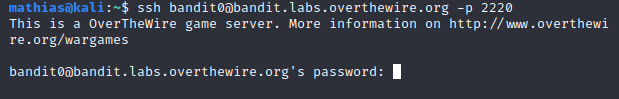

# Bandit0

<!--TODO: Gjelder alle writeupsene. Legge referansene til de andre temasidene, slik at man kan klikke på kommandoene som står skrevet på "Relevante sider".-->

Relevante sider: _ls_, _cat_, _ssh og intro_.

Vi skriver altså _ssh_-kommandoen og passordet, _bandit0_.

Da vil det dukke opp en del informasjon, mye likt det som står her. 
Det første som da er lurt å gjøre, er å bruke _ls_, rett og slett for å se hva vi har. 

_ls_ sier det er en fil som heter "readme". Vi ser ikke direkte at det er en tekstfil, men prøver vi å bruke _cd_ ser vi at det ikke er en mappe (not a directory). Hvis vi derimot bruker _cat_ for å se hva som er i filen, dukker flagget opp. 

Legg merke til at nå er brukernavn og maskin endret til "_bandit0@bandit_", fordi vi har brukt _ssh_ inn på en annen maskin/server og brukernavnet er _bandit0_. 

Deretter, skriver du _exit_ for å forlate _shellet_. Et nytt triks nå, vil være å trykke piltast opp. Dette henter den siste kommandoen du brukte. (Trykker du igjen, henter du den før der igjen). Bytt ut "0"-tallet med 1 og lim inn passordet du henta. 