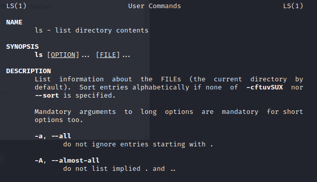

# Bandit3

Relevante sider: _ls_, _cat_, _man og whatis_

Her blir vi først hintet inn til en mappe som heter _inhere_. Vi går inn i den med _cd_. I den mappen prøver vi oss på _ls_ men finner ingenting. Ved å se på manualen til _ls_, ser vi at vi kan bruke et flagg, _-a_. Her står det at vi skal liste alle filer, til og med de som starter med et punktum. Gjør vi dette, finner vi en fil som heter _.hidden_. Det ser veldig mystisk ut, så åpner vi den med _cat_ finner vi flagget. 

