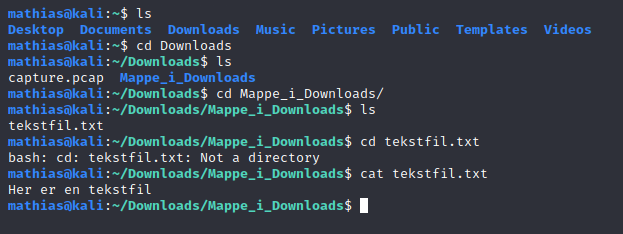

# cat
Dersom vi ønsker å se innholdet i en fil, kan vi bruke commandoen _cat_. _Cat_ står for "concatenate files and print on the standard output". Det betyr enkelt og greit "print ut det som står i filen". Hvis man prøver dette med et bilde eller andre filer som ikke enkelt lar seg skrive ut, kan man få et problem. ASCII-tekst og andre tekstfiler går helt fint å printe ut. 

Noen ganger er det ikke helt enkelt å bruke _cat_. Hvis navnet på filen du prøver å åpne ser ut som noe som PC'en tror kan være en del av en kommando, får den vanskeligheter. Derfor bruker man gjerne et punktum og skråstrek etter _cat_, forran navnet på filen. Dette vil vi se et eksempel av senere, under gjennomføringen av _bandit1_. 
Grunnnen til at "./" fungerer er fordi "." referer til mappen vi befinner oss i. Man kan altså skrive _cat ./navnpåfil_ for å poengtere at vi skal åpne denne filen i denne mappen som vi befinner oss i. I de fleste tilfeller er dette overflødig, men kan være nyttig, av og til. 

 Man kan andre ganger bruker fnutter ("") rundt navnet på filen. Spesielt hvis det er mellomrom i et filnavn, blir dette nødvendig. 

Eksempler her kan være hvis det er mellomrom i navnet på en fil, eller hvis navnet på filen er et tegn og ikke en/flere bokstaver. 

