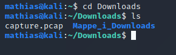
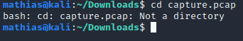

# cd (change directory)
_cd_ gjør at vi beveger oss fra en mappe til en annen.  Vi skriver da hvilken mappe vi vil inn i:

 ```bash
 mathias@kali:~$ cd Downloads 
 ``` 



I eksempelet ser vi hvordan jeg har gått inn i _Downloads_-mappen, og brukt _ls_-kommandoen igjen for å se hva som er i _Downloads_. Her ser vi en annen mappe, ved navn _Mappe_i_Downloads_. Dette er altså en annen mappe (_directory_) som man kan navigere seg inn til. I den terminalen jeg bruker, kan vi og se at mapper (directories) er markert i blått.
Filen _capture.pcap_ er IKKE en mappe eller et directory og man kan da ikke bruke _cd_ for å komme deg inn i den. Det er fil av typen .pcap. Det er filer som er laget av programmet _Wireshark_. Det er et program som brukes mye innenfor flere studier på NTNU, samt innenfor CTF. Mer om _Wireshark_ senere. 

_cd_ brukes og for å gå tilbake. Ved å bruke _cd .._ beveger vi oss en mappe tilbake. I eksempelet ser vi at vi er i _Downloads_-mappa, bruker _cd .._ og havner tilbake til hjem-mappa. Vi kan og se hvordan kun _cd_-kommandoen, uten å skrive noe mer, fører oss tilbake til hjem-mappa. Legg og merke til at hvis vi bruker _cd .._ på nytt og nytt, kommer vi tilbake til root(/)-mappa. Herfra kommer vi ikke lenger. Vi kan også skrive _cd /_ for å komme til root-mappa.  

Vi kan og skrive fullstendig _path_ til et directory og dermed bevege oss til mappa, uansett hvor den ligger (så lenge vi har privilegier til å gå inn i den mappa). 

Prøver man å bruke _cd_ på noe som ikke er en mappe får man en feilmelding. _cd_ brukes altså for å bevege seg inn i mapper. Det gir ikke noe mening å prøve å bevege seg inn i .pcap-filen. 



Hvis vi beveger oss inn i mappen som heter _Mappe_i_Downloads_, finner vi en tekstfil. Vi ser at det er en tekstfil, fordi den har _.txt_ bak seg. Vi husker så at det ikke går ann å bevege seg inn i filer ved _cd_, fordi det ikke er en mappe ("Not a directory").