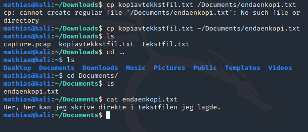
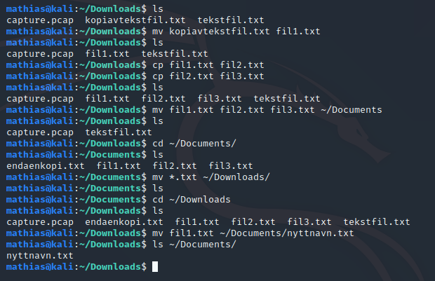

# cp og mv
_cp_ står for "copy". Dette kopierer altså en fil. Man bruker kommandoen ved å først skrive copy, så filen man skal kopiere, så hva den nye filen skal hete. Man kan da og skrive pathen til den nye filen, dersom du ønsker å ha den et annet sted. Merk at du må ha med "fullstendig path", om du vil at filen skal kopieres til en mappe, der du må "en mappe tilbake". Hvis jeg ønsker å kopiere fra /Downloads til /Documents, må jeg da ha med tilde-tegnet for å presisere det. 

_mv_ står for "move". Den fungerer på samme måte som _cp_, men da kopierer vi ikke, kun flytter. Vi kan og skrive nytt navn på samme måte som man gjør i _cp_. Det er og slik vi enklest mulig endrer navn på filer. Da bare flytter man filen til den samme mappen som den er, men med nytt navn. I eksempelet ser du bruk av både _cp_, _mv_, samt hvordan "wildcard", (*) kan brukes i praksis. Da den ble brukt, flytta jeg alle .txt-filer fra /Documents til /Downloads. Hvis jeg kun hadde ønsker å flytte "fil1.txt", "fil2.txt" og "fil3.txt", kunne jeg har skrevet _mv fil(stjerne).txt_ ... .

