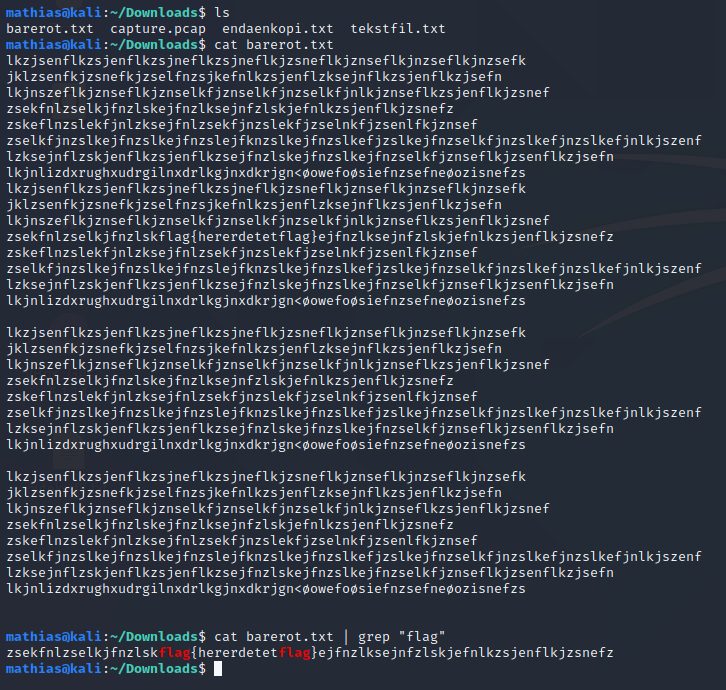

# grep
_grep_ leter etter "mønstre" i en fil. Det betyr kort oppsummert at den kan sortere. Dersom du får mye output etter å ha brukt en kommando, kan du prøve å bruke kommandoen igjen, men pipe (se "Pipe") for å finne det du leter etter. 

På bildet kan vi se hvordan vi kan hente ut et flag fra en fil med mye rot. _grep_ har mange andre tilleggsfunksjoner som kan være greit å sette seg inn i ved å sjekke _man grep_.