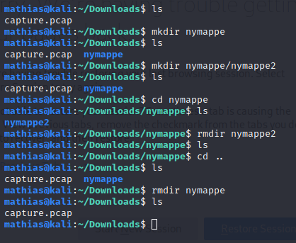

# mkdir og rmdir
Står for "make directory" og "remove directory". Lager/sletter en mappe i mappen du er i. Kan og lage en mappe andre steder ved å skrive pathen til stedet du vil lage mappe. _rmdir_ står for "remove directory". Sletter altså en mappe, men da må den være tom. Det kan unngås ved flagget du kan finne ved å bruke _man rmdir_. 

