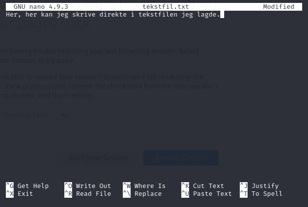
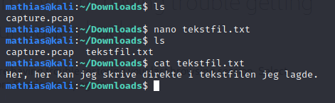

# nano
_nano_ oppretter en fil og lar deg skrive i den med en gang. _nano_ er en såkalt "text editor". Denne er og vanlig å bruke for å endre på konfigurasjoner i filer. Dette er i motsetning til å først bruke _touch_, for så å bruke _echo_ sammen med pil for å skrive inn til mappe. Merk at vi da havner inn i en egen "skrivefil". For å gå ut av filen og lagre, trykker man ctr+x og trykker "y" hvis du vil lagre, (deretter kommer om du vil endre navnet). Kommandoene under hjelper deg her. Her kan vi igjen presisere hva slags fil det er. I eksempelet skriver jeg:
 ```bash
 mathias@kali:~$ nano tekstfil.txt
 ``` 
 Dette lager altså en tekstfil med navnet tekstfil.txt. Man kan og kun skrive _nano_ for å gå rett inn i tekstskrivingen. Da må du skrive navn etter at du har trykket ctrl+q, y.

 
  