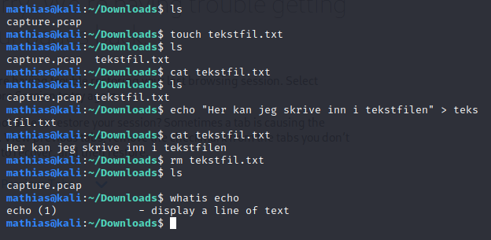

# touch, echo og rm

_touch_ kan lage en fil. Du kan gjerne spesifisere hva slags fil du lager. I eksempelet har jeg laget en tekstfil (.txt). 
_echo_ betyr bare å skrive en linje med tekst og sende det til _stdout_ (standard output, mer om det senere). Vi kan og kombinere _echo_ "krokodilletegn" (">") for å si at vi skal skrive inn til en fil. I eksempelet har jeg først laget en fil ved å bruke _touch_. Deretter har jeg brukt _echo_ med krokodilletegn/pil for å skrive til tekstfilen. Dette ser vi ved at jeg først brukte _cat_ på tekstfilen, fant ingenting, så skrev jeg litt tekst inn i tekstfilen, og deretter kom det tekst der. 
_rm_ står for "remove". Dette kan fjerne filer på samme måte som _rmdir_ fjerner mapper. 

