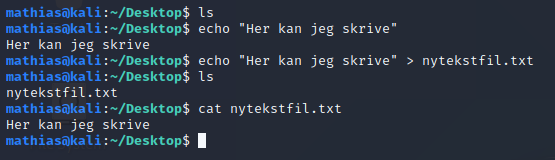

# Standard input, output og error

https://www.howtogeek.com/435903/what-are-stdin-stdout-and-stderr-on-linux/

Vi har så vidt vært innom _stdin_ og _stdout_. I terminalen, eller mer nøyaktig, i et shell, består kommandoene våre av det som kalles en stream. En stream (eller "strøm" på norsk, tenk en vannstrøm), har to åpninger. En inngang og en utgang. I bash (shellet vi bruker i Unix systemer), har vi egentlig en inngang (stdin), og to utganger (stdout) og (stderror). _stdin_ (standard input) er det shellet tar inn, som vi har skrevet. _stdout_ (standard output) er det shellet spytter ut, som vi ser som tekst på skjermen. Når vi skriver kommandoer i terminalen, er det shellet som tolker kommandoene. Når vi skriver en kommando, f.eks. _ls_, sender vi den til _stdin_, som vi da har sett utfører in binary-fil i /usr/bin, også spytter den up innholdet i mappa til oss som _stdout_. Dersom man prøver på noe man ikke får lov til, blir det spyttet ut som _stderr_ (standard error). Disse mappene er såpass viktige at de har fått egne tall assosiert med seg:
- 0: stdin
- 1: stdout
- 2: stderr

Vi ser dermed hvordan kommandoen _2>/dev/null_ markerer at all som kommer ut fra _stderr_ skal til vår intense søppelbøtte _/dev/null_. Det er dette som kalles "pipe" (som i "rør" på engelsk). Vi ser altså hvordan pilen tvinger en _stdout_ som _stdin_ til en annen fil. Dersom vi ønsker å bruke flere kommandoer samtidig, er dette også helt mulig. I stedet for å bruke pil, bruker vi da "|". 

Vi ser her hvordan echo først sender _stdout_ til displayet, i tekst, sånn at vi kan lese det. Dersom vi piper den inn i en tekstfil, får vi _stdout_ fra echo kommandoen som _stdin_ i tekstfilen.

Piping kan være ekstremt hjelpsomt i noen situasjoner. F.eks. blir kommandoen _grep_ (se "grep" i "Terminalkommandoer") gjerne brukt i kombinasjon av en _stdout_. 